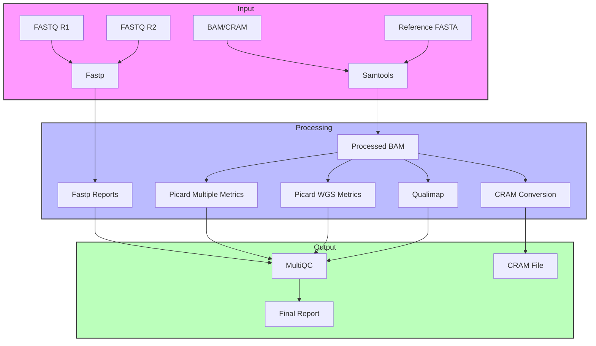

# WGS QC Workflow (Nextflow Version)

This is a Nextflow implementation of the WGS QC workflow for quality control and metrics collection of whole genome sequencing data.

## Overview

The pipeline performs comprehensive quality control and metrics collection for whole genome sequencing data. It supports both BAM and CRAM input formats and can optionally convert the final BAM to CRAM format.

## Architecture



## Requirements

- Nextflow 22.10.0 or later
- Docker
- Java 8 or later

## Installation

1. Clone this repository:
```bash
git clone <repository-url>
cd <repository-directory>
```

2. Make sure Nextflow is installed:
```bash
curl -s https://get.nextflow.io | bash
```

## Usage

The pipeline can be run using the following command:

```bash
nextflow run main.nf \
    --fastq_r1 "path/to/reads_R1.fastq.gz" \
    --fastq_r2 "path/to/reads_R2.fastq.gz" \
    --prefix "sample_name" \
    --fasta "path/to/reference.fasta" \
    --aligned_file "path/to/input.bam" \
    --cram false
```

### Parameters

- `--fastq_r1`: Path to the first read file (R1) in FASTQ format
- `--fastq_r2`: Path to the second read file (R2) in FASTQ format
- `--prefix`: Sample prefix to be used in output creation
- `--fasta`: Path to the reference genome in FASTA format
- `--aligned_file`: Path to the input BAM or CRAM file
- `--cram`: Whether to convert final BAM to CRAM format (default: false)

### Output

The pipeline generates the following outputs in the `results` directory:

- Fastp reports:
  - `{prefix}_fastp.html`
  - `{prefix}_fastp.json`
- Picard metrics:
  - Alignment summary metrics
  - Insert size metrics
  - Quality score distribution
  - Mean quality by cycle
  - Base distribution by cycle
  - WGS metrics
- Qualimap reports:
  - Coverage statistics
  - Mapping quality metrics
  - Insert size distribution
  - GC content analysis
- CRAM file (if `--cram true`):
  - `{prefix}.cram`
  - `{prefix}.cram.crai`
- MultiQC report:
  - `{prefix}_multiqc_report.html`
  - MultiQC data directory

## Docker Containers

The pipeline uses the following Docker containers:

- `staphb/fastp:latest` for read quality control
- `quay.io/biocontainers/samtools:1.21--h96c455f_1` for BAM/CRAM processing
- `broadinstitute/picard:latest` for metrics collection
- `quay.io/biocontainers/qualimap:2.3--hdfd78af_0` for alignment quality assessment
- `ewels/multiqc:latest` for report generation

## Reports

The pipeline generates several reports:

- `pipeline_report.html`: Pipeline execution report
- `timeline_report.html`: Timeline of pipeline execution
- `trace.txt`: Detailed execution trace

## Directory Structure

```
results/
├── fastp/              # Fastp quality control reports
├── picard/            # Picard metrics
├── qualimap/          # Qualimap reports
├── cram/              # CRAM files (if --cram true)
└── multiqc/           # MultiQC report and data
```

## License

This project is licensed under the terms of the license included in the repository.

## Author

George Carvalho (gcarvalhoneto@mednet.ucla.edu) 